---
title: Freshman UTECTF
description: This is a write-up for Cryptography in Freshman UTECTF
date: 2026-01-23
tags:
  - CTF
  - Write-up
image: "[[cover.png]]"
imageAlt: NoneSS
imageOG: false
hideCoverImage: false
hideTOC: false
targetKeyword: ""
draft: false
---


# Freshman UTECTF

## Shamir’s Secret

**Challenge:**

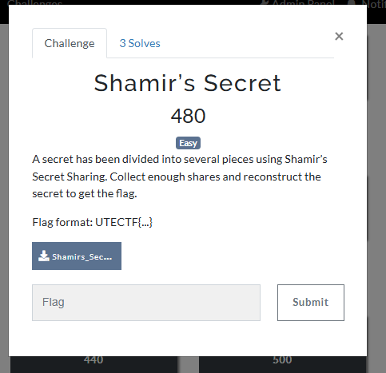

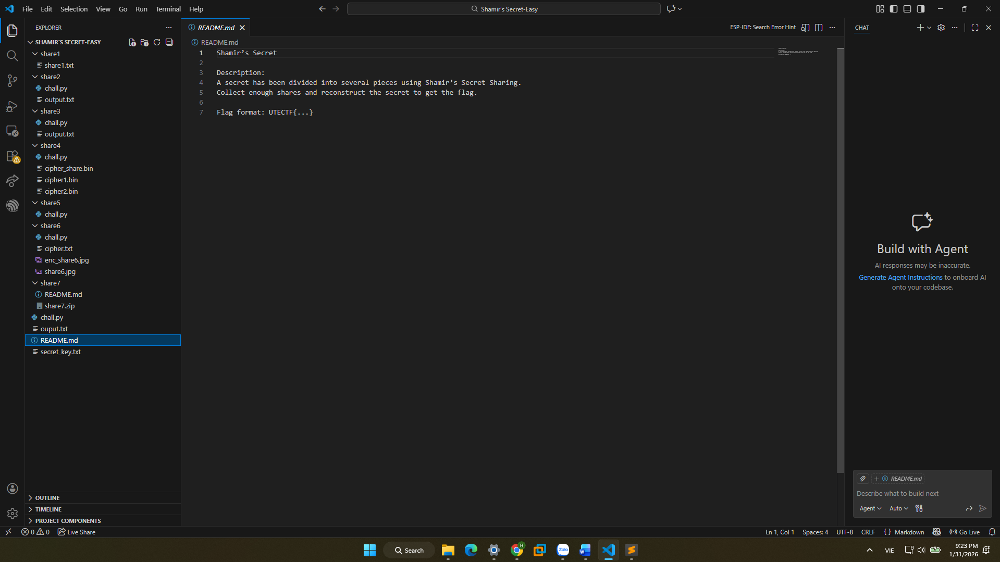


**Solution:**

Đề bài nhắc đến **Shamir’s Secret Sharing** và cung cấp file `chall.py`.

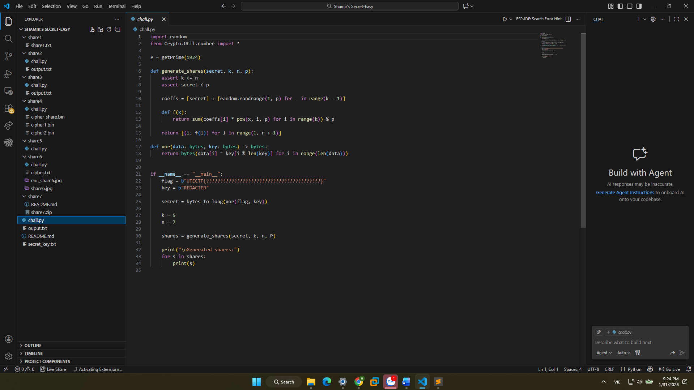

Phân tích code cho thấy:

- Flag được **XOR với key**
- Sau đó giá trị này được chia thành **7 shares**
- Chỉ cần **5/7 shares** là có thể khôi phục lại **secret**
- File `secret_key.txt` cho sẵn key:

```
secretkey
```

Do tính chất của XOR:

```
flag = secret ⊕ key
```

⇒ Khi khôi phục được `secret`, chỉ cần XOR lại với `key` là ra flag.

---

### 🐉 Hành trình tìm 7 viên ngọc rồng (7 Shares)

#### 🟠 Viên ngọc rồng 1 – Share có sẵn

Share đầu tiên đã được cung cấp trực tiếp:
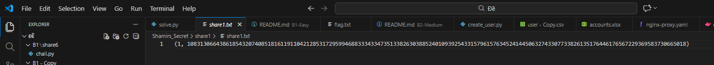

```
(1, 10831306643861854320740851816119110421285317295994688333433473513382630388524010939254331579615763452414450632743307733826135176446176567229369583730665018)
```

#### 🟠 Viên ngọc rồng 2 – Nhiều lớp encode
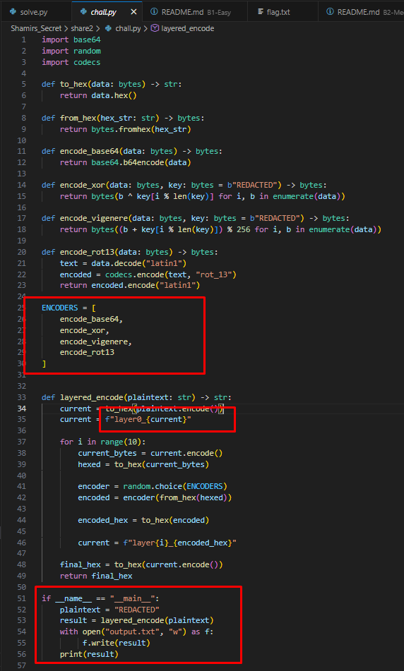

Share thứ 2 bị mã hóa qua nhiều lớp encode, mỗi lớp đều có tiền tố dạng:

```
layer{i}_
```

Chỉ có **4 kiểu encode** được sử dụng lặp lại.  
Ta bruteforce các cách decode khác nhau cho đến khi thu được chuỗi đúng định dạng `layer{i}_`.

Sau khi bóc hết các lớp:

```
(2, 2421663185798181823399928093766613650682372765774587699901200707113600894852880035481763255021389467421308639021556237253009737714128217792567033901234514)
```

---


#### 🟠 Viên ngọc rồng 3 – RSA yếu (Fermat Factorization)

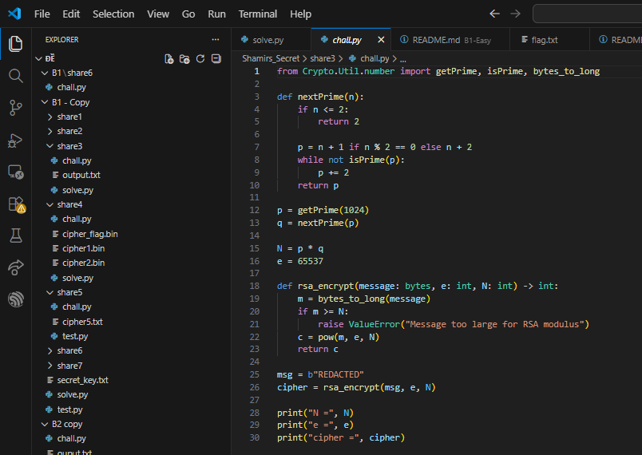

RSA sử dụng cặp số nguyên tố **p và q quá gần nhau**.

Áp dụng **Fermat Factorization** để phân tích `N`:

1. Tìm được `p` và `q`  
2. Tính lại `φ(n)`  
3. Tìm `d`  
4. Giải mã ciphertext để lấy share  

Kết quả:

```
(3, 5072048050549476426112005154771571490711602610454049877969009100822778328263778678204704997878878271953754517507261112012632034425357107926037275536721838)
```

---

#### 🟠 Viên ngọc rồng 4 – Lỗi stream cipher (keystream reuse)

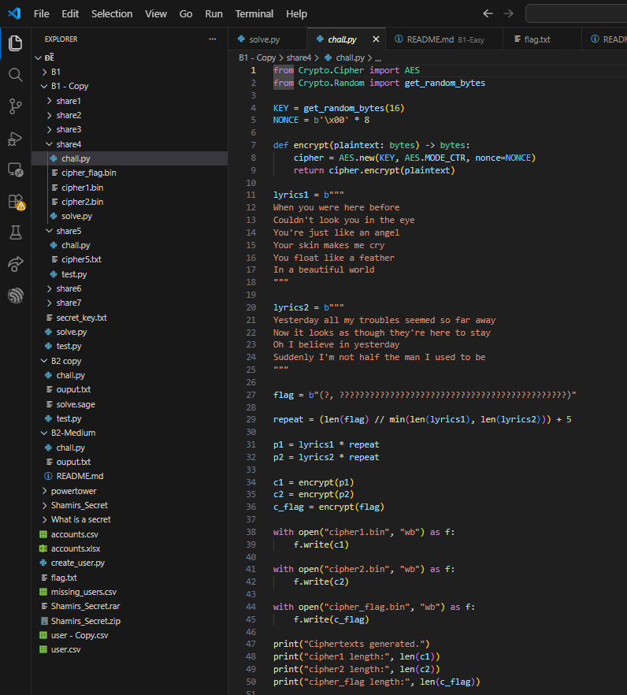

Biết plaintext của `cipher1`, ta có:

```
C = P ⊕ K  
⇒ K = C ⊕ P
```

Sau khi khôi phục được **keystream K**, ta dùng lại để giải mã `cipher_flag`:

```
P_flag = C_flag ⊕ K
```
=> Đây là lỗi bảo mật: **Two-time pad / keystream reuse**

Kết quả:

```
(4, 6574762259445009478648640997283522620898346013362677093578438142602996753317583582919187704852261308918024258232145913441153459941003979020672555533759238)
```

---
#### 🟠 Viên ngọc rồng 5 – Steganography bằng SPACE & TAB

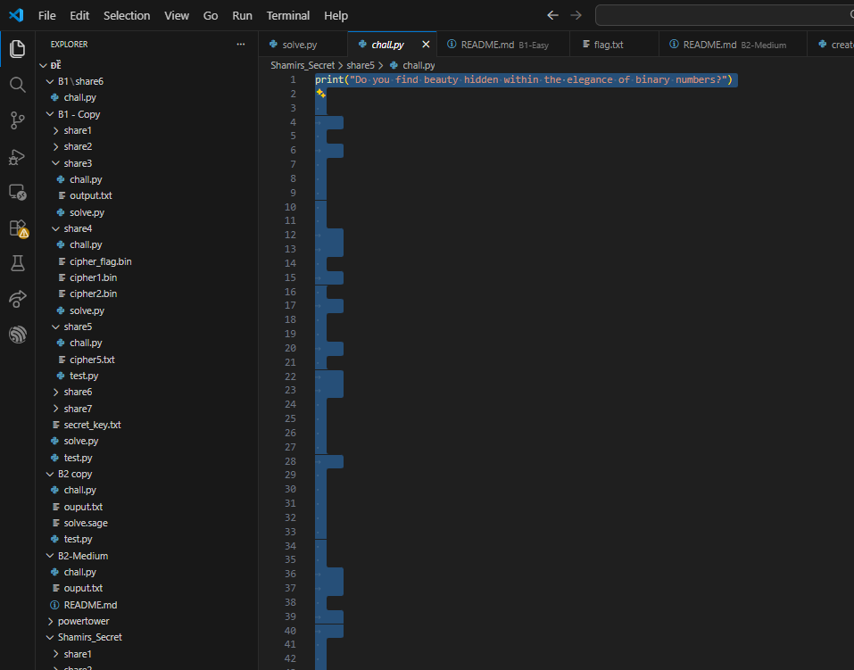

Các ký tự **TAB** và **SPACE** bị ẩn phía sau output `print`.

- `SPACE` → 0  
- `TAB` → 1  

Chuyển chuỗi nhị phân sang số nguyên ta được share:

```
(5, 6418171064351497551879298210964525807769985605045351821946195490032660897221088800361306534785263874676551547565494769908787299694666472095699698457928293)
```

---

#### 🟠 Viên ngọc rồng 6 – XOR + Frequency Analysis

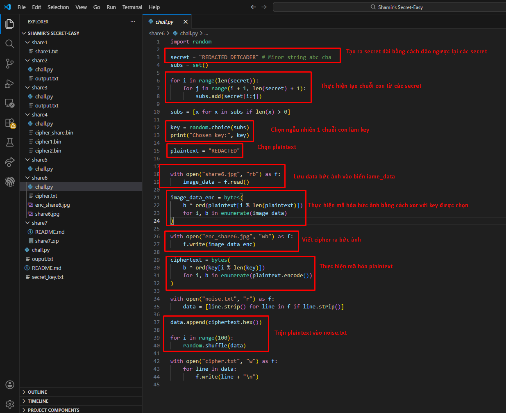

Một file ảnh bị XOR với một đoạn plaintext.  
Plaintext này lại bị XOR với **một chuỗi con của secret**, rồi trộn vào các đoạn hex gây nhiễu.

Cách giải:

1. Bruteforce tất cả chuỗi con có thể  
2. Giải mã ra nhiều plaintext ứng viên  
3. Dùng **frequency analysis** (tần suất chữ cái tiếng Anh) để chọn plaintext hợp lý nhất  

Kết quả:

```
(6, 4945755620883732728104047949819741788490475713328214091436056045064711922052436670902116271320486259677535667983540114119896258485128555368292346406946964)
```

---

#### 🟠 Viên ngọc rồng 7 – Zip password cracking

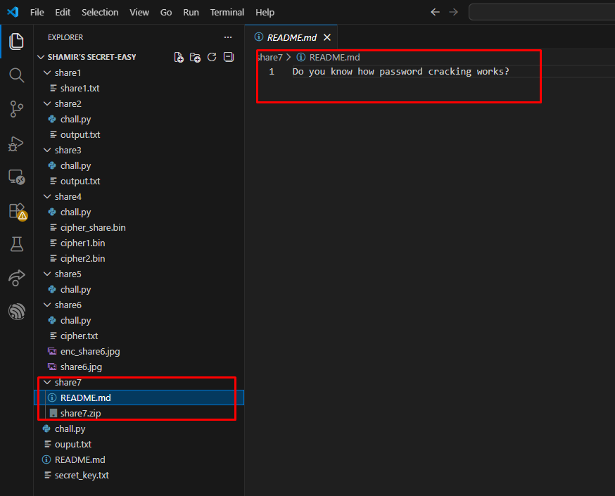

Một file `.zip` được bảo vệ bằng mật khẩu.

Dùng **John the Ripper** để crack mật khẩu và lấy được share cuối cùng:

```
(7, 3356112988404582601053569932197433270860342363318661483558861954026627424761117824547631322899403748454941498069462683112992460476360524253570959010669594)
```

---

### Khôi phục Secret bằng Shamir

Chỉ cần **5 bất kỳ trong 7 shares** để nội suy đa thức và tìm lại **secret**.

Sau khi có `secret`:

```
flag = secret ⊕ "secretkey"
```

Code solve:

```python
from Crypto.Util.number import *

def modinv(a, p):
    return pow(a % p, -1, p)

def recover_secret_mod(shares, p):
    secret = 0

    for j, (xj, yj) in enumerate(shares):
        num = 1
        den = 1
        for m, (xm, _) in enumerate(shares):
            if m != j:
                num = (num * (-xm)) % p
                den = (den * (xj - xm)) % p

        lj = num * modinv(den, p) % p
        secret = (secret + yj * lj) % p

    return secret


# ===== INPUT =====
p = 10840948326789369709667296027169418116365471749934022696128100965111034227774569045605104637380818859370432100230612268699912472707270572430387760136812949

shares = [
    (1, 10831306643861854320740851816119110421285317295994688333433473513382630388524010939254331579615763452414450632743307733826135176446176567229369583730665018),
    (2, 2421663185798181823399928093766613650682372765774587699901200707113600894852880035481763255021389467421308639021556237253009737714128217792567033901234514),
    (3, 5072048050549476426112005154771571490711602610454049877969009100822778328263778678204704997878878271953754517507261112012632034425357107926037275536721838),
    (4, 6574762259445009478648640997283522620898346013362677093578438142602996753317583582919187704852261308918024258232145913441153459941003979020672555533759238),
    (5, 6418171064351497551879298210964525807769985605045351821946195490032660897221088800361306534785263874676551547565494769908787299694666472095699698457928293),
    (6, 4945755620883732728104047949819741788490475713328214091436056045064711922052436670902116271320486259677535667983540114119896258485128555368292346406946964),
    (7, 3356112988404582601053569932197433270860342363318661483558861954026627424761117824547631322899403748454941498069462683112992460476360524253570959010669594),
]

# lấy bất kỳ 5 share
selected_shares = shares[:5]

secret = recover_secret_mod(selected_shares, p)
print("Recovered secret:", secret)

def xor(data: bytes, key: bytes) -> bytes:
    return bytes(data[i] ^ key[i % len(key)] for i in range(len(data)))
recovered_flag = xor(long_to_bytes(secret), b"secret_key")
print("Recovered flag:", recovered_flag)

```

**Flag:** `UTECTF{c0ngr4_0n_u51ng_5h4m1r5_53cr3t_5h4r1ng_5ucc355fully}`

## Mirror Split Secrets

**Challenge:**

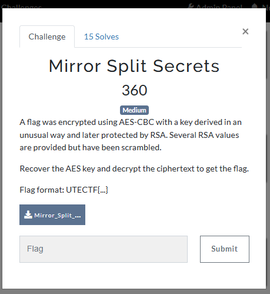

Đọc qua code và đề bài thì ta thấy chương trình dùng AES để mã hóa, được cung cấp sẵn Number và Scrambled keys để tìm được K_main.

Phân tích một chút về source được cho:
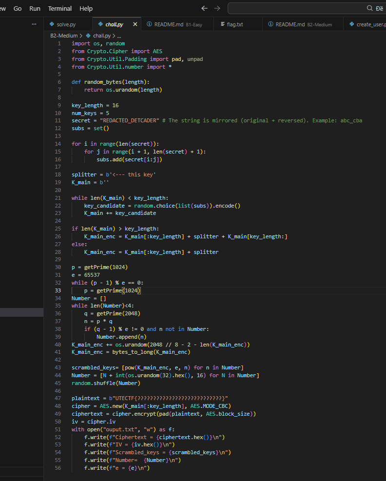

Đầu tiên, tạo key có độ dài >=16 bằng cách ghép random các chuỗi con tư secret sau đó được pad thêm 1 đoạn "<--- this key" giới hạn key và các ký tự dư thừa từ việc ghép chuỗi con. Cuối cùng được encrypt và lưu vào mảng scrambled.

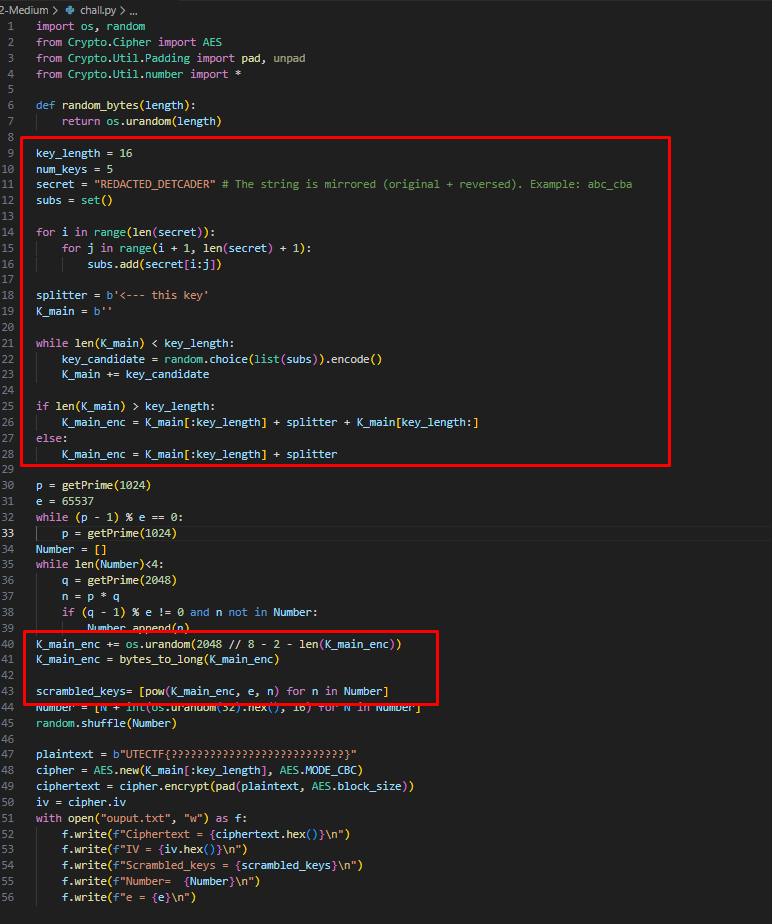

Ở đây, K_main_encrypt được dùng để mod với các n khác nhau được tạo ra, các n này đều có ước chung lớn nhất là p.

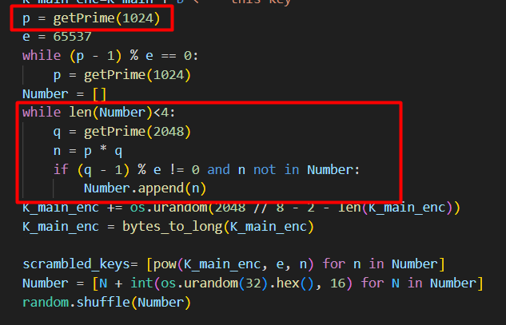

Hmmm, Hãy viết lại các quan hệ giữa \( K^e \) và các phần tử trong `scrambled_keys`:

$$
\begin{aligned}
(1)\quad & K^e - \text{scrambled\_keys}[0] = a \cdot n_1 \\
(2)\quad & K^e - \text{scrambled\_keys}[1] = b \cdot n_2 \\
(3)\quad & K^e - \text{scrambled\_keys}[2] = c \cdot n_3 \\
(4)\quad & K^e - \text{scrambled\_keys}[3] = d \cdot n_4
\end{aligned}
$$

Lấy hiệu từng cặp phương trình, ta thu được:

- Từ \((1) - (2)\):
$$
a \cdot n_1 - b \cdot n_2 = \text{scrambled\_keys}[1] - \text{scrambled\_keys}[0]
$$

- Từ \((3) - (4)\):
$$
c \cdot n_3 - d \cdot n_4 = \text{scrambled\_keys}[3] - \text{scrambled\_keys}[2]
$$

Lấy gcd của phương trình (5) và phương trình (6) thì ta sẽ tìm được p vì $n_1, n_2, n_3, n_4$ đều có được tạo thành từ p. Tuy nhiên vẫn có trường hợp $gcd(a-b, c-d)$ ra một con số x nào đó, khi đó kết quả trả về sẽ không phải là p mà là $x*p$.


Code solve:

```python
import os, random
from Crypto.Cipher import AES
from Crypto.Util.Padding import pad, unpad
from Crypto.Util.number import *
import math

Ciphertext = bytes.fromhex("d302d1821cb0b7b7113d16cf3c8667891dac6d5a0781fef6acba4ce1e2bba690")
IV = bytes.fromhex("c473197893bcd7b07e49972c885ee936")
Scrambled_keys = [1429747026382766110004250404182003148054633207816943947570477600177415549210732011220848962827771401602954571530803485229997695013558001320413849060476348033937127214042529894026927026068527952980438534287531580140129464774241817569343495785846268963621839598454744347537599724020866198599295371549992769237846597452908075441535279576486111727595179082694038540925241315584293797743105964315344737127322960869545206957040718543276161704991162613995189595736951904378645497002475369734932792464553763675569355805123384228121312536584093894725902562930994290247874588213873469086817538009340623041031533053373333969044096140013696409780806311065799431620710502561087868583230762496745647352507570198716380709938621766169432203348537252207119554848789724594006818578022117948692120309796395354082830736746815952823636672657742448069007355535949919955734718837444589606343405628302782777270588914046159061157187008680634124677493, 1598324245611918604115520131710716582719586928912718739778639938019704773469577421727811596228288762480216287142935756641576113000599207946597914166501710751122215230659807013075284220090834660517699792633050526602682357977349150030294512502052162298017469792149231254546477764056748649739578241880666902041177835000208738014569096387318157114434289376301532707207862401542982526073875043382239524570151007944454546870782775833608645557358602147050997955861238622850934565623022286079232567984847498299789122078977632815259127476150896001306667613346076531933390190429709475616439491509981226957223297465719797242117359739146146068788062943473196189374290268695098772710647381957771170393602294192465418997283065965859020152654926389467028643776240238406632569240001699658640507165855213267435746763655274562142170266267156920068500085767124061366647119669754087322844764703089473663165091830832884777475657910920621249964175, 2400060531711851303104619961361465429703731846356657517868551250975153600604633984304846621583288512459703612512789672040026188228098042835699564507590568428194382475881796893050109156110023455816040665712566380482406869567975027698487490404650554759083581722680541191746480401432204717362831886453865982904571715968930756570578446839990080578661203932743263113284777942940905081429913849008261010762433718886929604879051987160443302093252541619259092561258712361498126217972091878816321283632445133884387893859675081845726207208570813141502787182094416070240819906379414404582409705491691667488472749650540248581703497653733660385446697676085445273211821945725561129926404068114136496070475064155049620053626027906897244986911438171418005428442236554475873012780196474007587738671480382108748780335798423917579291570825550598424701967744676585098377717012427990498756197285823256616116004090892363810924959033194924928168799, 963510408055114261246238522115199039236382705151525463762965846117308279381249883570281135409639267186297634868267437352234531251943523911478853771372148784201719734932120625214849352336849637203369131791797804141047466479308612818132887726527429172963299912719025126051826664422932060442706094120017597157346068924386896434127189489674720087779505166450262170538059242700030833706694465263751039040008365530543133297579147151562509399948273565379847984587266035296715348533598042622762643997219243582982838356557615844990830360032455087975455614072912222638273236350794659980597287852270760323892583767286701979047509891916285499957842383400484838642358785781393433544579180014392852489799590718541669363257706010173502816498581880495025653153992746964180483228827500567945265072042523519701384892399261808728549340269246166936573895147404422309300817464626521880904730285879262866141682976293472070668974000152254130896183]
Number=  [2531220613389089120067083169201025713076353207789550365124939267701938999651244993467453544940584231497699766243721748422269033215385668736470932489159226445773312995434483972789480119866463648293546052924735994709764441846413941699988191054234222921438787697072474560054788041859595755263742498319904633521847654594657161318108042006676751257412391732384577162783068269725652660719607130320658392242573400150337568765203218728640665648615339574763315517512324108376744509550598621781088464701123644714130841756960303686998405636171495566545484152054375577174823112470631593710148716199966870288015797805623922847324208322634627162631429409744717138502927045109130203181108375630554693320715130942370524199242992975580412313794502338744234230300191812089604965807187895111358852017046177080800709274897814026148344941952371612418063259328865622539149895170775517297326863487546272655806417003397761438437640939614623967258836, 2608492877126560844470886347538630490220502369635049313384777785570738589644450593653071158635438463706588455024574778973159903046975290172123715577445530999961729460614439373520830087729254284469909900852949896956029112164671044021697129139361143577685800504804516520982279126047271078265210599460628798520222231341625293936959540878250561751719482020837757111020620949808660066964106866067977434567915076937637756115084097063932667364080351667378953528764339421768124137876433535571715826358332847182542364168502795182428514405965613828534549490669200708688324448434202397668248828460061885028160446098960570034837665040974314324781100791895423986651999380990415344884096789125877684379670738871255709305873462960556021243387020146204580790284930934548656055822694236936192009560461851540414515333591726843458364565725367301962726101223868650403627723290017182440706509261056746810289840499455629176729898249536163234896843, 4706386905448429083399936152611622307315580512854149100191081685589727469523138944663598799390461907333738933345687571797504429617207149502738928298714418938152430600649871913052694534150330783579169112948810338512741507932543802505606100653926748193944199414565577006885332261522305051616423874775606553718873684302888840202474150025251531913572451937451664408652524279391657748830783456776199397237724205475421921886504735113308354042747391764047610717211725772568743438703108963794400705343851297124537925793096198624752256189897847741222475690130182602322681095129506226299165595087624082942375348461609873389651241841310813531294730941718381944287277037979833357902847353635901112705800754472709496906207398372587154451883490135841688310530353543008368261253582937415524960280971304588560299312973265664134658933861405339146311295410708249547333609745868201497306841958204487678235809163515012543396425605227559572526449, 2643991435776179292310763339541906402794160062011202850517752993008176331641055554997924143387226644391925176014015250868029000980466136227106784452567728578971295518991901562716695043138858798880105106115073828008794035073018598108284215704232907849691745477448198133537009923092596507615865678112200576490200892519937789269841773342422731393883100675157540956568390543772872257888903246005128891589826568778177771303450904563913768924065195131735178343690731918933584292594940512761134118349118229264068625738683038517276408343948667617897099256458753606461912327899199862968704802595111474285415283477489211883145953477204725310837173559060645252268659980778508707302192982495592958408146895563308592433223790854913289856173556888770921187703637967247417864732490507878944328459689202309354235712558401327931117756903756465980009887325812730575966980553462264232890732360942264231508630437709794800587581304957817595990100]

e = 65537

g = math.gcd(abs(Scrambled_keys[1] - Scrambled_keys[2]), abs(Scrambled_keys[3] - Scrambled_keys[0]))
p_factor =  factor(g)
p = p_factor[len(p_factor) - 1][0]
N_0 = Number[2] - Number[2] % p
q = N_0 // p
tot = (p - 1) * (q - 1)
d = inverse(e, tot)
print("p =", p)

K_main = b""

for i in Scrambled_keys:
    K_main_enc = long_to_bytes(pow(i, d, N_0))
    if b"this key" in K_main_enc:
        K_main = K_main_enc.split(b"<--- this key")[0]
        break

cipher = AES.new(K_main, AES.MODE_CBC, IV)
plaintext = unpad(cipher.decrypt(Ciphertext), AES.block_size)

print("Plaintext:", plaintext.decode())
```

**Flag:** `UTECTF{W3_l0v3_A35_4nd_R54}`

