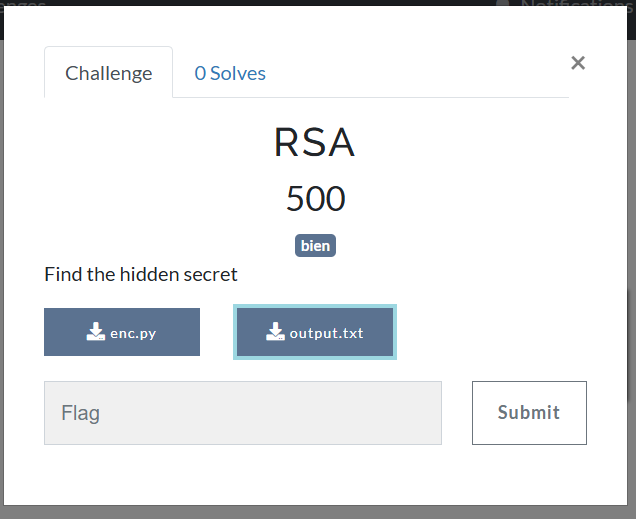
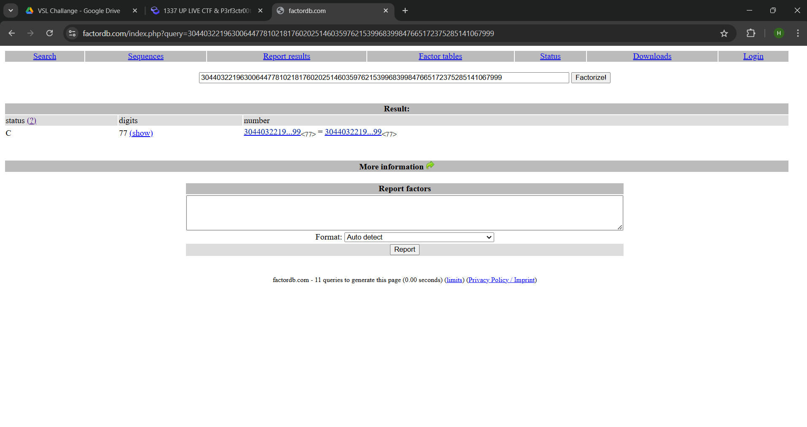
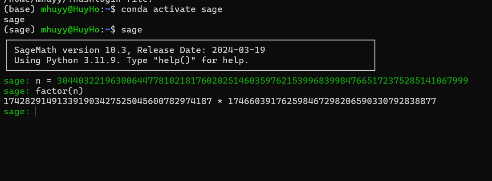
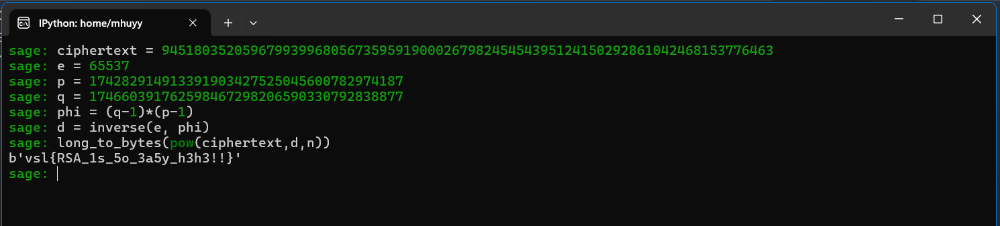
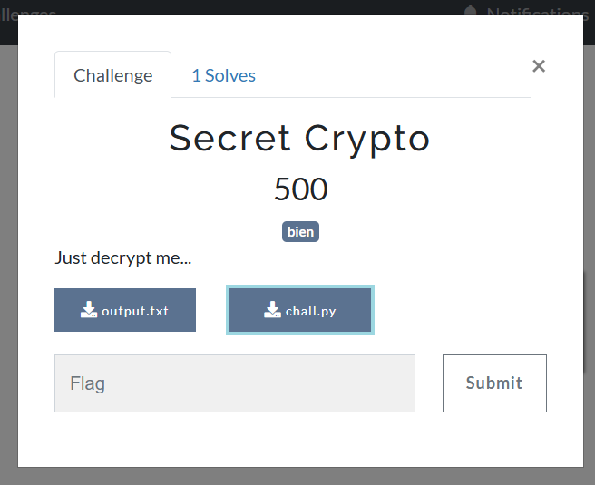
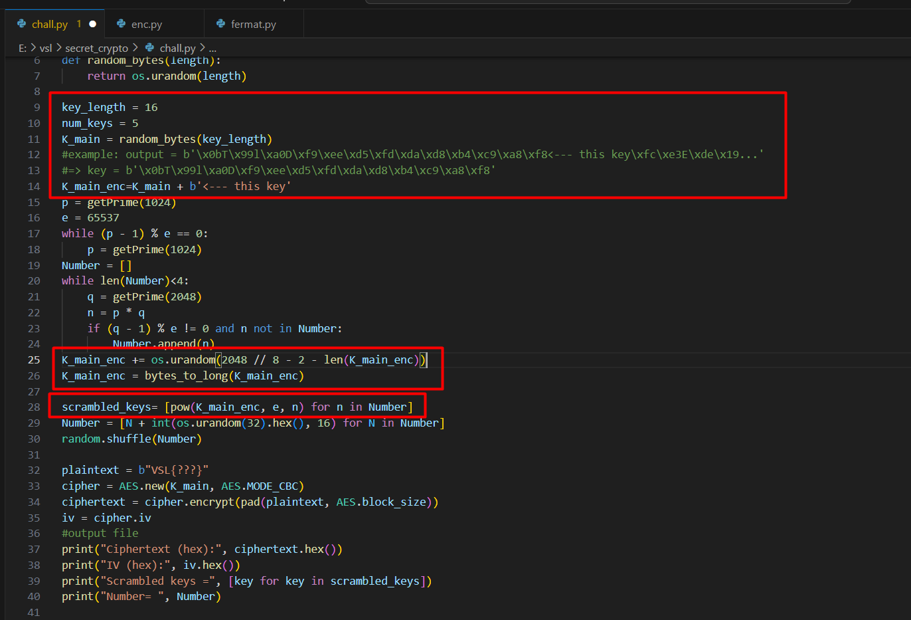
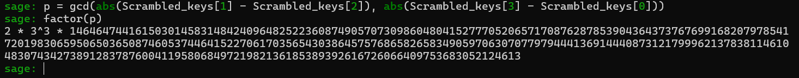

---
title: VSL 2024 
description: This is a write-up for VSL CTF 2024
date: 2026-01-01
tags:
  - CTF
  - Write-up
image: "[[cover.png]]"
imageAlt: None
imageOG: false
hideCoverImage: false
hideTOC: false
targetKeyword: ""
draft: false
---

# VSL

[Link to Google Drive](https://drive.google.com/drive/folders/1gHDH-aYv7Fiug3Z3YJQODZYl1-DWbxg2?usp=sharing)

## RSA

**Challenge:**



**Solution:**

Đọc sơ qua source đề cho và file text, ta thấy $n$ được tạo thành từ chỉ $p$ và $q$ và cả 2 đều 128 bit.

Khả năng cao là phải đi tìm factor của $n$ để tìm được $p$ và $q$.

Trước hết thì mình sẽ up lên [factordb.com](http://factordb.com) để tìm xem trong db có số đó chưa.



Và wow, không bất ngờ lắm vì trên đây không có.

Sau đó mình liền triển khai ý tưởng thứ 2 là dùng factor của sage để tìm trong khi tìm ra cách khác.

Oh, mình chưa suy nghĩ ra cách khác thì hàm đã trả về cho mình $p$ và $q$ luôn rồi=)).



Khi có được $p$ và $q$ thì mình cứ làm như 1 bài rsa thông thường thôi.



**Flag:** `vsl{RSA_1s_5o_3a5y_h3h3!!}`

## Secret Crypto

**Challenge:**



Đọc qua code và đề bài thì ta thấy chương trình dùng AES để mã hóa, được cung cấp sẵn Number và Scrambled keys để tìm được K_main.

Phân tích một chút về source được cho:

Đầu tiên, tạo key có độ dài 16 bằng `os.urandom()` sau đó được pad thêm 1 đoạn "<--- this key" giới hạn key và các bytes ngẫu nhiên từ hàm `os.urandom()` nữa. Cuối cùng được encrypt và lưu vào mảng scrambled.



Ở đây, K_main_encrypt được dùng để mod với các n khác nhau được tạo ra, các n này đều có ước chung lớn nhất là p.


Hmmm, Hãy viết lại các quan hệ giữa \( K^e \) và các phần tử trong `scrambled_keys`:

$$
\begin{aligned}
(1)\quad & K^e - \text{scrambled\_keys}[0] = a \cdot n_1 \\
(2)\quad & K^e - \text{scrambled\_keys}[1] = b \cdot n_2 \\
(3)\quad & K^e - \text{scrambled\_keys}[2] = c \cdot n_3 \\
(4)\quad & K^e - \text{scrambled\_keys}[3] = d \cdot n_4
\end{aligned}
$$

Lấy hiệu từng cặp phương trình, ta thu được:

- Từ \((1) - (2)\):
$$
a \cdot n_1 - b \cdot n_2 = \text{scrambled\_keys}[1] - \text{scrambled\_keys}[0]
$$

- Từ \((3) - (4)\):
$$
c \cdot n_3 - d \cdot n_4 = \text{scrambled\_keys}[3] - \text{scrambled\_keys}[2]
$$

Lấy gcd của phương trình (5) và phương trình (6) thì ta sẽ tìm được p vì $n_1, n_2, n_3, n_4$ đều có được tạo thành từ p. Tuy nhiên vẫn có trường hợp $gcd(a-b, c-d)$ ra một con số x nào đó, khi đó kết quả trả về sẽ không phải là p mà là $x*p$.

Và đây là đoạn code để tìm key:



Vậy là ta đã có được p, giờ thì tìm key và solve thôi:

```python
import os, random
from Crypto.Cipher import AES
from Crypto.Util.Padding import pad, unpad
from Crypto.Util.number import *

Ciphertext = bytes.fromhex("1dc3c5d62bf6e24ec677be15d39e7e6d0a719300b45fb02ef69d167d3ec369c8d856f0c718924d45b21466680935615f")
IV = bytes.fromhex("d0c05440bbd86e1ed2a56e8a9fc1c010")
Scrambled_keys = [...]
Number =  [...]

e = 65537

# p = gcd(abs(Scrambled_keys[1] - Scrambled_keys[2]), abs(Scrambled_keys[3] - Scrambled_keys[0]))
# factor(p)
p = 146464744161503014583148424096482522360874905707309860480415277705206571708762878539043643737676991682079785417201983065950650365087460537446415227061703565430386457576865826583490597063070779794441369144408731217999621378381146104830743427389128378760041195806849721982136185389392616726066409753683052124613
N_0 = Number[2] - Number[2] % p
q = N_0 // p
tot = (p - 1) * (q - 1)
d = inverse(e, tot)

K_main = b""

for i in Scrambled_keys:
    K_main_enc = long_to_bytes(pow(i, d, N_0))
    if b"this key" in K_main_enc:
        K_main = K_main_enc.split(b"<--- this key")[0]
        break

cipher = AES.new(K_main, AES.MODE_CBC, IV)
plaintext = unpad(cipher.decrypt(Ciphertext), AES.block_size)

print("Plaintext:", plaintext.decode())

# Flag: VSL{AES_and_crypto_is_not_easy!!!}

